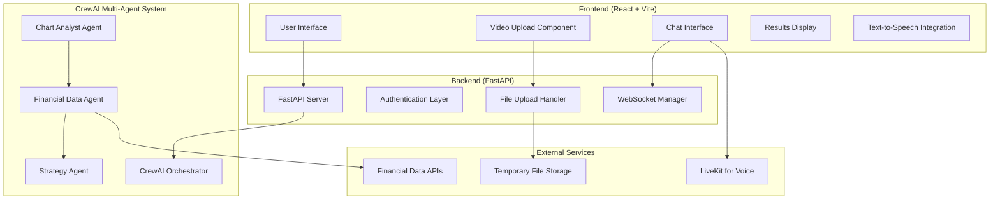

# Design Document

## Overview

The Multimodal AI Trading Assistant is a full-stack application that leverages CrewAI's multi-agent framework to provide sophisticated trading analysis through video chart uploads. The system architecture separates concerns between a React frontend for user interaction and a FastAPI backend that orchestrates specialized AI agents for video analysis, data gathering, and strategy formulation.

The application builds upon the existing CrewAI foundation in the workspace, extending it with new specialized agents and integrating it with a modern web interface and real-time communication capabilities.

## Technology Stack Reference

### ForexAiAgent Crew (Base System)
- **Framework**: CrewAI for multi-agent orchestration
- **Python**: 3.10-3.12 (strict version requirement)
- **Package Manager**: UV for dependency management
- **Configuration**: YAML files for agents and tasks
- **API Keys**: OpenAI API key required in `.env`

### Frontend (Adapted from Gemini LangGraph)
- **Framework**: React 19 + TypeScript
- **Build Tool**: Vite for development and build
- **Styling**: Tailwind CSS v4 + Shadcn UI (New York style)
- **Icons**: Lucide React
- **Routing**: React Router DOM
- **Markdown**: React Markdown for content rendering

### Backend Integration
- **API Framework**: FastAPI for high-performance endpoints
- **Multi-Agent System**: CrewAI orchestrating specialized trading agents
- **LLM Integration**: OpenAI API for agent intelligence
- **File Handling**: Multimodal LLM processing for video analysis
- **Real-time Communication**: WebSocket for live updates
- **Authentication**: Auth0 for secure user management
- **Database**: Supabase (PostgreSQL) for data persistence
- **File Storage**: Supabase Storage for video uploads

## Project Structure Reference

### Current Workspace Structure
```
├── .kiro/                          # Kiro IDE configuration and specs
├── gemini-fullstack-langgraph-quickstart-main/  # Reference LangGraph project
├── src/forex_ai_agent/             # Existing CrewAI forex system (base)
├── knowledge/                      # User preferences and context
├── tests/                          # Test files
├── pyproject.toml                  # Root Python project config
└── README.md                       # Main project documentation
```

### Planned Multimodal Trading Assistant Structure
```
multimodal-trading-assistant/
├── backend/                        # FastAPI + CrewAI backend
│   ├── src/
│   │   ├── agents/                 # CrewAI agent definitions
│   │   │   ├── chart_analyst.py    # Video analysis agent
│   │   │   ├── data_agent.py       # Market data agent
│   │   │   └── strategy_agent.py   # Strategy formulation agent
│   │   ├── tools/                  # Custom tools for agents
│   │   │   ├── video_analysis.py   # Multimodal video processing
│   │   │   ├── market_data.py      # Financial API connectors
│   │   │   └── strategy_tools.py   # Risk calculation tools
│   │   ├── api/                    # FastAPI endpoints
│   │   │   ├── video_upload.py     # Video processing endpoints
│   │   │   ├── chat.py             # WebSocket chat endpoints
│   │   │   └── strategy.py         # Strategy retrieval endpoints
│   │   ├── config/                 # YAML configuration files
│   │   │   ├── agents.yaml         # Agent definitions (roles, goals)
│   │   │   └── tasks.yaml          # Task definitions
│   │   ├── crew.py                 # Main crew orchestration logic
│   │   └── main.py                 # FastAPI application entry point
│   ├── .env                        # Environment variables (API keys)
│   └── pyproject.toml              # Backend dependencies
├── frontend/                       # React application (adapted from LangGraph)
│   ├── src/
│   │   ├── components/             # React components
│   │   │   ├── ui/                 # Shadcn UI components
│   │   │   ├── VideoUpload.tsx     # Video upload component
│   │   │   ├── TradingTimeline.tsx # Activity timeline (adapted)
│   │   │   ├── ChatInterface.tsx   # Chat interface (adapted)
│   │   │   ├── StrategyDisplay.tsx # Trading strategy results
│   │   │   └── WelcomeScreen.tsx   # Welcome screen (adapted)
│   │   ├── lib/                    # Utility functions
│   │   │   └── utils.ts            # Helper functions
│   │   ├── hooks/                  # Custom React hooks
│   │   │   └── useCrewAI.ts        # CrewAI API integration hook
│   │   ├── App.tsx                 # Main app component
│   │   ├── main.tsx                # App entry point
│   │   └── global.css              # Tailwind + custom styles
│   ├── package.json                # Frontend dependencies
│   ├── vite.config.ts              # Vite configuration
│   └── components.json             # Shadcn UI configuration
├── docker-compose.yml              # Development environment
├── Dockerfile                      # Container build instructions
└── Makefile                        # Development commands
```

### Key Configuration Files
- **Environment Variables**: Store API keys in `.env` files
- **YAML Configs**: Use for agent/task definitions in CrewAI
- **Separate Concerns**: Frontend/backend clearly separated
- **Docker Ready**: Support containerized deployment for hackathon demo

## Architecture

### High-Level Architecture



### Technology Stack

**Frontend:**
- React 18 with TypeScript
- Vite for build tooling and development server
- Tailwind CSS for styling
- React Query for state management and API calls
- React Dropzone for file uploads
- LiveKit React SDK for continuous voice interactions with Voice Activity Detection

**Backend:**
- FastAPI for high-performance API endpoints
- CrewAI for multi-agent orchestration
- Pydantic for data validation
- WebSockets for real-time communication
- Multimodal LLM integration (GPT-4V or similar) for direct video processing
- LiveKit for text-to-speech and speech-to-text functionality

**Infrastructure:**
- File storage for temporary video processing
- Redis for session management (optional)
- Environment-based configuration

## Components and Interfaces

### Frontend Components

#### VideoUploadComponent
```typescript
interface VideoUploadProps {
  onUploadComplete: (videoId: string) => void;
  onUploadProgress: (progress: number) => void;
  maxFileSize: number;
  acceptedFormats: string[];
}
```

#### ChatInterface
```typescript
interface ChatMessage {
  id: string;
  type: 'user' | 'assistant';
  content: string;
  timestamp: Date;
  audioUrl?: string;
  isVoiceMessage?: boolean;
}

interface VoiceState {
  isListening: boolean;
  isProcessing: boolean;
  isSpeaking: boolean;
  voiceModeActive: boolean;
}

interface ChatInterfaceProps {
  messages: ChatMessage[];
  onSendMessage: (message: string) => void;
  onToggleVoiceMode: () => void;
  voiceState: VoiceState;
  isProcessing: boolean;
}
```

#### StrategyDisplay
```typescript
interface TradingStrategy {
  tradingPair: string;
  entryPoints: number[];
  stopLoss: number;
  takeProfits: number[];
  riskAssessment: string;
  confidence: number;
  reasoning: string;
}
```

### Backend API Endpoints

#### Video Processing Endpoints
```python
@app.post("/api/videos/upload")
async def upload_video(file: UploadFile) -> VideoUploadResponse

@app.get("/api/videos/{video_id}/status")
async def get_analysis_status(video_id: str) -> AnalysisStatus

@app.get("/api/videos/{video_id}/strategy")
async def get_trading_strategy(video_id: str) -> TradingStrategy
```

#### Chat Endpoints
```python
@app.websocket("/ws/chat/{session_id}")
async def chat_websocket(websocket: WebSocket, session_id: str)

@app.post("/api/chat/tts")
async def text_to_speech(text: str) -> AudioResponse
```

### CrewAI Agent Specifications

#### Chart Analyst Agent
```yaml
chart_analyst:
  role: >
    Multimodal Chart Analysis Specialist
  goal: >
    Analyze trading chart videos frame-by-frame to identify trading pairs, 
    technical indicators, chart patterns, and market structure
  backstory: >
    You are an expert technical analyst with advanced computer vision capabilities.
    You specialize in extracting structured information from trading charts and
    identifying key technical elements that inform trading decisions.
  tools:
    - video_frame_extractor
    - chart_pattern_detector
    - indicator_identifier
```

#### Financial Data Agent
```yaml
financial_data_agent:
  role: >
    Real-time Market Data Specialist
  goal: >
    Gather current market data, price information, and order book details
    for identified trading pairs
  backstory: >
    You are a financial data expert with access to multiple market data sources.
    You excel at gathering comprehensive, real-time market information and
    presenting it in a structured format for analysis.
  tools:
    - crypto_api_connector
    - forex_data_fetcher
    - market_data_aggregator
```

#### Strategy Agent
```yaml
strategy_agent:
  role: >
    Senior Trading Strategy Formulator
  goal: >
    Synthesize chart analysis and market data to create comprehensive
    trading strategies with specific entry, exit, and risk management parameters
  backstory: >
    You are a seasoned trading strategist with deep expertise in technical analysis
    and risk management. You excel at combining multiple data sources to formulate
    actionable trading strategies with clear risk parameters.
  tools:
    - risk_calculator
    - strategy_validator
    - market_condition_assessor
```

## Data Models

### Core Data Structures

```python
from pydantic import BaseModel
from typing import List, Optional
from datetime import datetime

class ChartAnalysis(BaseModel):
    trading_pair: str
    timeframe: str
    technical_indicators: List[str]
    chart_patterns: List[str]
    support_levels: List[float]
    resistance_levels: List[float]
    trend_direction: str
    confidence_score: float

class MarketData(BaseModel):
    symbol: str
    current_price: float
    volume_24h: float
    price_change_24h: float
    bid_price: Optional[float]
    ask_price: Optional[float]
    timestamp: datetime

class TradingStrategy(BaseModel):
    trading_pair: str
    strategy_type: str
    entry_points: List[float]
    stop_loss: float
    take_profit_levels: List[float]
    position_size_recommendation: str
    risk_reward_ratio: float
    confidence_level: float
    reasoning: str
    market_conditions: str

class AnalysisSession(BaseModel):
    session_id: str
    video_id: str
    status: str  # 'processing', 'completed', 'failed'
    chart_analysis: Optional[ChartAnalysis]
    market_data: Optional[MarketData]
    trading_strategy: Optional[TradingStrategy]
    created_at: datetime
    completed_at: Optional[datetime]
```

### Database Schema (if persistent storage needed)

```sql
-- Sessions table for tracking analysis progress
CREATE TABLE analysis_sessions (
    id UUID PRIMARY KEY,
    video_filename VARCHAR(255),
    status VARCHAR(50),
    created_at TIMESTAMP,
    completed_at TIMESTAMP,
    chart_analysis JSONB,
    market_data JSONB,
    trading_strategy JSONB
);

-- Chat history for conversation context
CREATE TABLE chat_messages (
    id UUID PRIMARY KEY,
    session_id UUID REFERENCES analysis_sessions(id),
    message_type VARCHAR(20),
    content TEXT,
    timestamp TIMESTAMP
);
```

## Error Handling

### Frontend Error Handling
- Network connectivity issues with retry mechanisms
- File upload failures with clear error messages
- WebSocket connection drops with automatic reconnection
- Audio/video permission handling for voice features

### Backend Error Handling
- Video processing failures with detailed error reporting
- API rate limiting and timeout handling
- Agent execution failures with graceful degradation
- File storage and cleanup error management

### Agent Error Handling
```python
class AgentErrorHandler:
    @staticmethod
    def handle_chart_analysis_error(error: Exception) -> ChartAnalysis:
        # Return partial analysis or request user clarification
        pass
    
    @staticmethod
    def handle_data_fetch_error(error: Exception) -> MarketData:
        # Use cached data or alternative sources
        pass
    
    @staticmethod
    def handle_strategy_error(error: Exception) -> TradingStrategy:
        # Provide conservative strategy or flag for manual review
        pass
```

## Testing Strategy

### Unit Testing
- Individual agent functionality testing
- API endpoint testing with FastAPI TestClient
- React component testing with React Testing Library
- Utility function testing for data processing

### Integration Testing
- End-to-end CrewAI workflow testing
- API integration testing with mock external services
- Frontend-backend integration testing
- File upload and processing pipeline testing

### Performance Testing
- Video processing performance benchmarks
- Concurrent user load testing
- API response time optimization
- Memory usage monitoring for video processing

### Security Testing
- File upload security validation
- API authentication and authorization testing
- Input sanitization and validation testing
- Data privacy and cleanup verification

## Deployment Architecture

### Development Environment
```yaml
# docker-compose.dev.yml
version: '3.8'
services:
  frontend:
    build: ./frontend
    ports:
      - "3000:3000"
    volumes:
      - ./frontend:/app
  
  backend:
    build: ./backend
    ports:
      - "8000:8000"
    volumes:
      - ./backend:/app
    environment:
      - ENVIRONMENT=development
```

### Production Considerations
- Container orchestration with Docker
- Load balancing for multiple backend instances
- CDN for frontend static assets
- Secure file storage with automatic cleanup
- Environment variable management for API keys
- Monitoring and logging infrastructure

## Security Considerations

### Data Protection
- HTTPS enforcement for all communications
- Temporary file storage with automatic deletion
- No persistent storage of trading strategies without user consent
- API key management and rotation

### Authentication & Authorization
- JWT-based authentication for API access
- Rate limiting to prevent abuse
- Input validation and sanitization
- CORS configuration for frontend-backend communication

### Privacy
- Video files deleted after processing completion
- Chat history optional retention with user consent
- No logging of sensitive trading information
- Compliance with data protection regulations